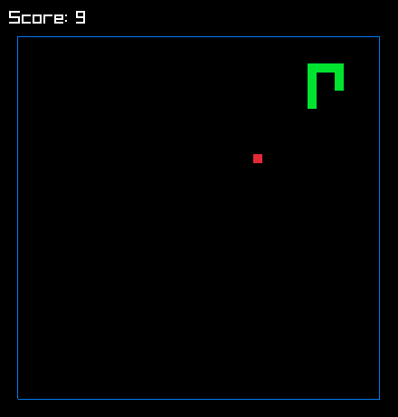

Minimalistic snake clone. Expects [raylib](https://www.raylib.com) in the host system. Compiled with `zig 0.14.0-dev.1939+816dfca0b`.

```shell
zig build run
```



Dynamic allocation might be an overkill here. Learning was the main reason why I have decided to use it anyway.
